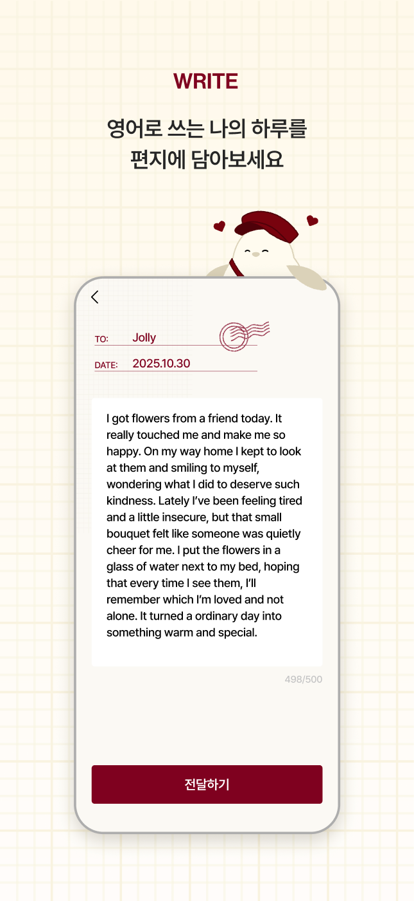
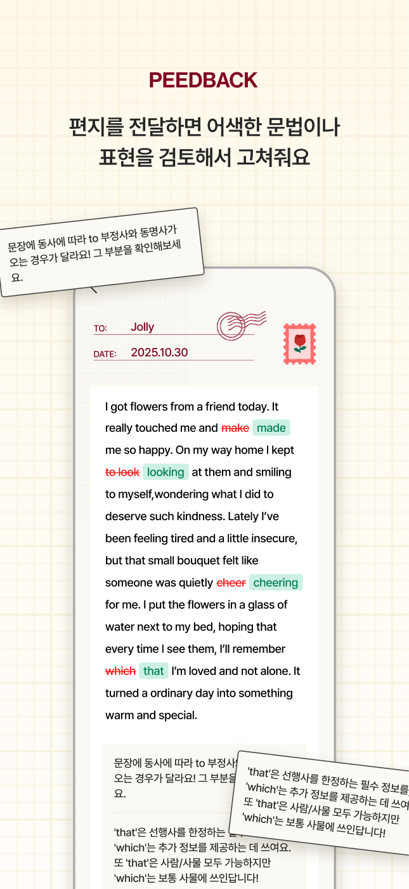
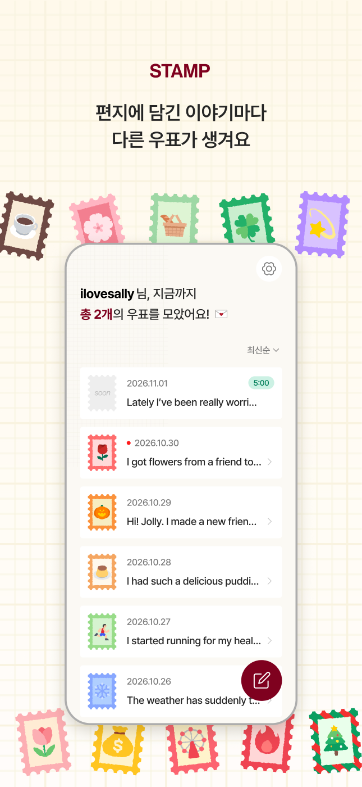
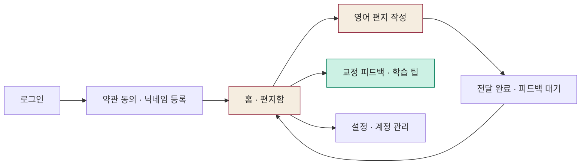
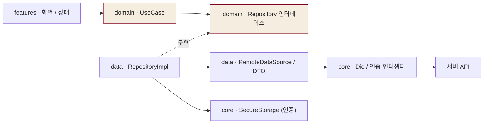

<div align="center">


# Dear Jolly · 디어 졸리

**Write to Jolly, feel jolly**

오늘의 이야기를 영어 편지로 남기고,<br />
졸리의 교정 피드백과 우표로 나만의 기록을 쌓아가는 모바일 서비스

<p>
  
  
  
</p>

[서비스 소개](#서비스-소개) · [주요 화면](#주요-화면) · [아키텍처](#프로젝트-구조와-아키텍처) · [기술 스택](#기술-스택) · [Contributors](#contributors)

[Figma 디자인 보기](https://www.figma.com/design/pefUeII1iwdOtgnDiwBmSr/Dear-Jolly?node-id=964-8750&m=dev)

</div>

---

## 서비스 소개

**Dear Jolly는 일상의 영어 글쓰기를 편지를 주고받는 경험으로 풀어낸 서비스입니다.** 하루의 작은 사건이나 마음에 남은 이야기를 졸리에게 건네고, 어색한 문법과 표현을 돌아보며 다음 편지를 이어갑니다.

| Write | Feedback | Stamp |
| :--- | :--- | :--- |
| 영어로 오늘의 이야기를 작성해요. | 원문과 교정 표현, 학습 팁을 함께 확인해요. | 편지에 연결된 우표와 기록을 모아봐요. |

아이보리 편지지, 버건디 포인트, 우표와 봉투 일러스트로 편지를 쓰는 분위기를 담았습니다. 이 저장소는 **Flutter 모바일 클라이언트**를 다루며, 편지·피드백·우표 데이터는 서버 API와 연동합니다.

## 주요 화면

<table>
  <tr>
    <td align="center" width="33%"></td>
    <td align="center" width="33%"></td>
    <td align="center" width="33%"></td>
  </tr>
  <tr>
    <td align="center"><b>01 · 편지 작성</b><br />졸리에게 전하는 오늘의 영어 일기</td>
    <td align="center"><b>02 · 피드백</b><br />고친 표현과 이유를 한눈에</td>
    <td align="center"><b>03 · 편지함과 우표</b><br />쌓이는 기록을 다시 읽는 즐거움</td>
  </tr>
</table>

<sub>위 이미지는 Figma의 앱스토어 소개 시안입니다. 예시 문구·날짜·우표 수·배치는 실행 화면과 다를 수 있으며, 아래 기능 설명은 현재 코드를 기준으로 작성했습니다. [이미지 출처](docs/readme-images/SOURCES.md)</sub>

### 사용자 흐름



| 단계 | 구현된 경험 |
| :--- | :--- |
| 시작 · 로그인 | 앱 버전과 인증 상태 확인 후 진입 화면 결정. 카카오 로그인과 iOS의 Apple 로그인 제공 |
| 온보딩 | 약관 동의 → 닉네임 등록 → 환영 화면. 완료 여부에 따라 필요한 단계로 이동 |
| 편지함 | 우표 수, 편지 목록, 최신순·오래된 순 정렬, 페이지 이동, 새 피드백 및 대기 상태 표시 |
| 편지 작성 | 영문·숫자·기본 기호 중심 입력, 최대 500자, 전달 전 확인, 제출 실패 안내와 재시도 |
| 교정 확인 | 수정 전 표현은 취소선, 교정 표현은 초록색 강조. 서버에서 받은 학습 팁 표시 |
| 설정 | 닉네임 변경, 약관·개인정보 처리방침 확인, 문의, 로그아웃, 회원 탈퇴 |

## 프로젝트 구조와 아키텍처

기능별 화면을 `features`에 모으고, **도메인 규칙과 데이터 접근을 분리**했습니다. Riverpod Provider가 데이터 소스·저장소·유스케이스를 연결하고, 화면은 유스케이스를 통해 작업을 요청합니다.

```text
lib/
├── main.dart                 # ProviderScope와 앱 시작점
├── app/                      # 앱 구성, GoRouter 라우팅과 접근 제어
├── core/
│   ├── config/               # API 및 서비스 설정
│   ├── di/                   # Riverpod 의존성 연결
│   ├── network/              # Dio, 인증 인터셉터, API 예외
│   ├── platform/             # 앱 정보, 기기 시간대 등 플랫폼 기능
│   ├── storage/              # 인증 정보 보관
│   ├── theme/                # 색상·타이포그래피·테마
│   ├── utils/                # 닉네임 검증 등 공통 도구
│   └── widgets/              # 버튼·편지 카드·다이얼로그 등 공통 UI
├── features/
│   ├── splash/               # 초기 버전·세션 확인
│   ├── login/                # 소셜 로그인과 콜백
│   ├── onboarding/           # 약관·닉네임·환영 화면
│   ├── home/                 # 편지 목록·정렬·피드백 상태 갱신
│   ├── write/                # 편지 작성·제출·완료
│   ├── review/               # 교정 결과와 학습 팁
│   ├── settings/             # 설정과 계정 관리
│   └── update/               # 강제 업데이트 안내
├── domain/
│   ├── entity/               # User, Letter, LetterReview 등
│   ├── model/                # Result: Success / Failure
│   ├── repository/           # 데이터 접근 인터페이스
│   └── usecase/              # auth / letter / version 작업
└── data/
    ├── auth/                 # 인증 API·DTO·저장소 구현
    ├── letter/               # 편지 API·DTO·저장소 구현
    └── version/              # 버전 API·DTO·저장소 구현

assets/                       # 이미지·SVG 아이콘·Lottie·Pretendard
test/                         # 단위·위젯 테스트
android/ · ios/               # 모바일 플랫폼 설정
```



의존성 구성은 [providers.dart](lib/core/di/providers.dart), 라우팅은 [routes.dart](lib/app/routes.dart)에서 확인할 수 있습니다. API 응답은 DTO에서 Entity로 변환하고, 저장소 구현은 성공·실패를 `Result`로 전달합니다.

상태 관리는 화면별로 구성되어 있습니다. Riverpod을 통한 의존성 주입과 편지 제출의 `AsyncNotifier`, 스플래시의 `ChangeNotifier` 기반 ViewModel, 홈·리뷰 등의 `ConsumerStatefulWidget` 내부 상태를 함께 사용합니다.

## 기술 스택

버전은 [pubspec.yaml](pubspec.yaml)의 **선언 범위**이며, 해석된 의존성 버전은 [pubspec.lock](pubspec.lock)에 기록됩니다.

| 영역 | 사용 기술 | 적용 내용 |
| :--- | :--- | :--- |
| 앱 · 언어 | Flutter · Dart `^3.10.1` | iOS·Android 모바일 UI와 앱 로직 |
| 상태 · 의존성 주입 | `flutter_riverpod ^3.3.2` | Provider 구성, 유스케이스 주입, 편지 제출 상태 |
| 라우팅 | `go_router ^15.1.2` | 화면 이동, 로그인·온보딩 상태에 따른 리다이렉트 |
| 네트워크 | `dio ^5.7.0` | REST API 통신, 인증 헤더, 토큰 갱신 |
| 인증 정보 저장 | `flutter_secure_storage ^9.2.4` | 액세스·리프레시 토큰과 온보딩 상태 보관 |
| 로그인 · 외부 연결 | `app_links ^7.0.0` · `url_launcher ^6.3.2` | 소셜 로그인 콜백 수신, 외부 URL 열기 |
| 플랫폼 정보 | `package_info_plus ^9.0.1` · `flutter_timezone ^5.1.0` | 앱 버전 확인, 편지 작성 시 기기 시간대 전달 |
| 그래픽 · 모션 | `flutter_svg ^2.3.0` · `lottie ^3.3.3` | SVG 아이콘·일러스트, 로딩 애니메이션 |
| 타이포그래피 | Pretendard | Regular · Medium · SemiBold · Bold 폰트 |
| 품질 확인 | `flutter_test` · `flutter_lints ^6.0.0` | 단위·위젯 테스트와 정적 분석 규칙 |

## 개발 포인트

### 1. 인증부터 온보딩까지 이어지는 진입 제어

로그인 콜백으로 받은 세션을 저장하고, 토큰·약관 동의·닉네임 등록 상태를 기준으로 화면 접근을 제어합니다. 앱 시작 시 서버 버전 정책을 확인해 강제 업데이트 화면으로 연결하는 흐름도 구성했습니다.

### 2. 동시에 만료된 요청의 토큰 갱신 처리

[AuthInterceptor](lib/core/network/auth_interceptor.dart)는 401 응답에 대해 토큰을 갱신하고 원래 요청을 재시도합니다. 진행 중인 갱신 Future를 공유해 중복 갱신을 줄이고, 재시도 표시로 같은 요청이 반복 갱신되지 않도록 처리합니다.

### 3. 피드백을 기다리는 동안의 사용자 경험

[홈 화면](lib/features/home/view/home_screen.dart)은 제출·검토 중·완료·실패 상태를 구분합니다. 대기 편지가 있을 때 10초 간격으로 상태를 확인하고, 앱이 비활성 상태이거나 대기 대상이 없으면 폴링을 멈춥니다. 요청 제한 오류에는 1분 대기를 적용합니다. 카운트다운 표시와 서버의 실제 완료 상태를 별도로 다룹니다.

### 4. 교정 결과를 읽기 쉬운 표현으로 변환

[리뷰 DTO](lib/data/letter/dto/letter_review_dto.dart)에서 교정 구간을 순서대로 정리하고, [리뷰 화면](lib/features/review/view/review_screen.dart)에서 원문 취소선과 교정 강조를 조합합니다. 피드백이 없거나 생성에 실패한 경우의 화면도 구분합니다.

### 5. 반복되는 브랜드 UI의 공통화

[테마](lib/core/theme/)와 [공통 위젯](lib/core/widgets/)으로 색상, 글꼴, 버튼, 편지 헤더, 우표 카드와 다이얼로그를 관리합니다. 개별 화면에서도 같은 편지 서비스의 인상이 이어지도록 구성했습니다.

## Contributors

<table>
  <tr>
    <td align="center">
      <a href="https://github.com/yeonjeen">
        <br />
        <b>YeonJeen</b><br />
        @yeonjeen
      </a>
    </td>
  </tr>
</table>

## 로컬 실행

Dart `^3.10.1` 조건을 만족하는 Flutter SDK와 Android 또는 iOS 개발 환경이 필요합니다. iOS 실행에는 macOS와 Xcode가 필요합니다.

```bash
flutter pub get
flutter run --dart-define=JOLLY_API_BASE_URL=https://YOUR_API_HOST/api/v1
```

`YOUR_API_HOST`는 사용할 백엔드 주소로 바꿔주세요. 로그인과 편지 기능을 사용하려면 해당 서버 및 소셜 로그인 콜백 설정이 연결되어 있어야 합니다.

<details>
<summary><b>환경 설정과 검증 명령</b></summary>

[ApiConfig](lib/core/config/api_config.dart)의 설정은 `--dart-define`으로 전달할 수 있습니다.

| 설정 | 용도 |
| :--- | :--- |
| `JOLLY_API_BASE_URL` | 백엔드 API 기본 주소 |
| `JOLLY_AUTH_SCHEME` | 로그인 콜백 스킴, 기본값 `dearjolly`. 네이티브 앱 설정과도 일치해야 함 |
| `JOLLY_APP_VERSION` | 플랫폼에서 앱 버전을 읽지 못했을 때의 대체값 |
| `JOLLY_IOS_STORE_URL` · `JOLLY_AOS_STORE_URL` | 업데이트 안내에서 열 스토어 주소 |
| `JOLLY_TIME_ZONE` | 기기 시간대 조회 실패 시 대체값, 기본값 `Asia/Seoul` |

```bash
flutter analyze
flutter test
```

테스트 코드는 [test/](test/)에서 확인할 수 있습니다.

</details>

---

<div align="center">

**오늘의 한 문장이, 내일의 조금 더 자연스러운 영어가 되도록.**<br />
Write to Jolly, feel jolly ✉️

</div>
